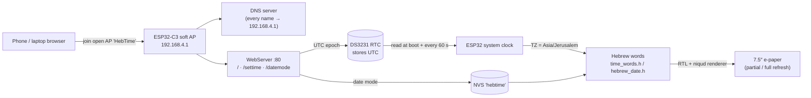

# hebrew-time-rtc

A **Hebrew word clock** that displays the current time spelled out in Hebrew
words (with full niqud) on a 7.5″ e-ink panel. Time is kept by a battery-backed
DS3231 hardware RTC, so the clock survives power loss and stays accurate
without any network connection.

The time is set from a phone or laptop over a self-hosted Wi-Fi access point
with a captive portal — no router, no NTP, no cloud.

This is the offline sibling of [hebrew-clock-ntp](https://github.com/t0mer/hebrew-clock-ntp)
(same display and rendering, time from NTP) and
[hebrew-clock](https://github.com/t0mer/hebrew-clock) (server-rendered clock). See
[Related projects](#related-projects).

---

## Table of contents

- [Features](#features)
- [Hardware](#hardware)
- [How it works](#how-it-works)
- [Software / build](#software--build)
- [First-time setup and usage](#first-time-setup-and-usage)
- [HTTP endpoints](#http-endpoints)
- [Configuration](#configuration)
- [Troubleshooting](#troubleshooting)
- [Known issues](#known-issues)
- [Security notes](#security-notes)
- [Project layout](#project-layout)
- [Related projects](#related-projects)
- [Credits](#credits)
- [Contributing](#contributing)
- [License](#license)

---

## Features

- **Time in Hebrew words** — e.g. *"שֶׁבַע וְעֶשֶׂר דַקּוֹת בַּבֹּקֶר"* (7:10 in the morning),
  rendered right-to-left with correctly positioned vowel marks (niqud), on two
  or three centered lines.
- **Battery-backed timekeeping** — a DS3231 RTC holds the time across reboots
  and power cuts; no Wi-Fi or NTP needed to stay accurate.
- **Set the time from any browser** — connect to the open `HebTime` Wi-Fi
  network and the captive portal opens automatically; one tap writes the
  device's clock to the RTC.
- **DST-correct** — the RTC stores **UTC**; the Israel timezone
  (`Asia/Jerusalem`, UTC+2 / UTC+3 with DST) is applied only for display, so the
  clock changes for daylight saving on its own.
- **Selectable top-row date** — show either the **Gregorian** date
  (e.g. `14 בְּיוּנִי 2026`) or the **Hebrew/Jewish** date
  (e.g. `כ״ט בְּסִיוָן תשפ״ו`). The choice is saved in flash (NVS).
- **E-ink friendly** — partial refresh on every minute change, and a full
  refresh on first draw, when the date or date mode changes, and after every 15
  partial refreshes, to keep the panel clean and ghost-free.
- **Self-contained** — no Wi-Fi credentials, no server, no external resources;
  the web page is embedded in the firmware.

---

## Hardware

| Part | Detail |
|---|---|
| MCU | **Seeed Studio XIAO ESP32-C3** |
| Display | **7.5″ e-paper**, 800 × 480, on the Seeed XIAO ePaper Driver Board (UC8179, board/screen combo **502**) |
| RTC | **DS3231** module (I²C, battery-backed) with a **CR2032** coin cell |
| Power | USB-C (the AP stays up so the time can be reset at any time — no deep sleep) |

### Wiring (RTC ↔ XIAO)

The e-paper driver board uses the XIAO's default SPI pins **and** GPIO4/GPIO5
(D2/D3) for the panel's BUSY/DC lines, so the DS3231 must sit on the secondary
I²C pins:

| DS3231 | XIAO pin | GPIO |
|---|---|---|
| SDA | **D4** | GPIO6 |
| SCL | **D5** | GPIO7 |
| VCC | 3V3 | — |
| GND | GND | — |

In code this is `Wire.begin(6, 7);`.

The solder pads on the XIAO ESP32-C3 (SDA → **D4**, SCL → **D5**, plus
**3V3** and **GND**) are shown below. Power the DS3231 from the **3V3** pad —
**not** the 5 V pad two positions above it:


See **[rtc.md](rtc.md)** for the full RTC setup, time-setting flow, and
troubleshooting.

---

## How it works



- **Time source.** `setup()` reads the DS3231 over I²C and seeds the ESP32
  soft-clock with `settimeofday()`; the soft-clock is re-synced from the RTC
  every 60 s to avoid drift. `loop()` checks the time continuously and
  redraws on each minute change.
- **Lost power.** If `rtc.lostPower()` reports that the oscillator stopped (first
  run, or a dead/missing coin cell), the time is treated as unknown and the panel
  shows an error screen asking you to set it over Wi-Fi.
- **Timezone.** The RTC always holds **UTC**. The POSIX TZ string
  `IST-2IDT,M3.4.4/26,M10.5.0` is set via `setenv("TZ", …)` + `tzset()`, so
  `getLocalTime()` yields Israel local time with automatic DST.
- **Word rendering.** Hebrew time phrases live in `time_words.h` (hours, the
  `ל`-prefixed "to the hour" forms for :40/:45/:50/:55, minute fragments, and
  the time-of-day period — לִפְנוֹת בֹּקֶר (04:00–05:59) / בַּבֹּקֶר / בַּצָּהֳרַיִם / בָּעֶרֶב / בַּלַּיְלָה).
  A custom RTL renderer reverses each word for the LTR framebuffer and centers
  each niqud mark on its base letter (GFX fonts have no GPOS, so combining marks
  are positioned manually). Digit runs (day, year) are kept left-to-right.
- **Font.** A single 85 px `NotoSerifHebrew_Bold_85` bitmap font (from the
  vendored `Seeed_GFX/Fonts/Custom/`) is downscaled on the fly (majority
  sampling): about 80 px for the time and about 42 px for the date line.
- **Hebrew date.** `hebrew_date.h` is a generated Gregorian→Hebrew lookup table
  (1,676 days, range **2026-06-01 … 2031-01-01**, generated from the
  hebcal.com converter), binary-searched per day; geresh/gershayim
  numerals are swapped for ASCII `'`/`"` (the font lacks those code points).
  Outside that range the top row falls back to the Gregorian date.
- **Refresh strategy.** Minute changes use a differential **partial refresh** of
  the time area (800 × 400 below the date strip) and are skipped entirely when
  the rendered text did not change; a **full refresh** runs on the first draw,
  on date change, on date-mode change, and after every 15 partials to clear
  e-ink ghosting.

---

## Software / build

### Toolchain

- **Arduino IDE** (or `arduino-cli`) with the **esp32** board package by
  Espressif; select the **XIAO_ESP32C3** board.
  <!-- TODO: verify minimum esp32 core version the sketch was built with -->
- Set the Arduino **sketchbook location** (IDE: *File → Preferences*) to this
  repository's `Arduino/` folder, so the IDE picks up the vendored libraries in
  `Arduino/libraries/` instead of any globally installed copies.
- Open the sketch at `Arduino/Clock/Clock.ino`.

### Libraries

All libraries are vendored under `Arduino/libraries/`. Only some are actually
used by the sketch:

| Library | Version | Used by the sketch | License |
|---|---|---|---|
| [Seeed_GFX](https://github.com/Seeed-Studio/Seeed_GFX) | 2.0.3 | **Yes** — `EPaper` / `TFT_eSPI` driver, `gfxfont.h`, the 85 px Hebrew font | Mixed (FreeBSD / MIT / BSD), see its `license.txt` |
| [RTClib](https://github.com/adafruit/RTClib) | 2.1.4 | **Yes** — `RTC_DS3231` | MIT |
| [Adafruit BusIO](https://github.com/adafruit/Adafruit_BusIO) | 1.17.4 | **Yes** — dependency of RTClib | MIT |
| [Adafruit GFX Library](https://github.com/adafruit/Adafruit-GFX-Library) | 1.12.5 | No | BSD |
| [GxEPD2](https://github.com/ZinggJM/GxEPD2) | 1.6.8 | No | GPL-3.0 |
| [U8g2_for_Adafruit_GFX](https://github.com/olikraus/U8g2_for_Adafruit_GFX) | 1.8.0 | No | BSD-2-Clause |
| [ArduinoJson](https://arduinojson.org/) | 7.4.3 | No | MIT |
| [RTC](https://github.com/cvmanjoo/RTC) | 1.12.0 | No | Public domain (Unlicense) |

`WiFi`, `WebServer`, `DNSServer`, `Preferences`, `Wire` and `SPI` come with the
ESP32 Arduino core.

The vendored **Seeed_GFX** is adjusted for this project:

- `User_Setup_Select.h` defines `BOARD_SCREEN_COMBO 502` and
  `USE_XIAO_EPAPER_DRIVER_BOARD`, so the library's own source files are built
  for the same board as the sketch (otherwise linking fails with
  `undefined reference to EPaper::…`).
- `User_Setups/Setup502_Seeed_XIAO_EPaper_7inch5.h` already defines
  `USE_PARTIAL_EPAPER`.
- `Fonts/Custom/NotoSerifHebrew_Bold_85.h` holds the Hebrew font the sketch
  includes.

### Driver / board selection

`Arduino/Clock/driver.h` selects the panel:

```c
#define BOARD_SCREEN_COMBO 502
#define USE_XIAO_EPAPER_DRIVER_BOARD
```

### Enable partial refresh (required)

The partial-update path needs this line in the TFT/e-paper setup header
(`User_Setups/Setup502_Seeed_XIAO_EPaper_7inch5.h`):

```c
#define USE_PARTIAL_EPAPER
```

The vendored copy already has it. If you build against a different Seeed_GFX
install, add it yourself — without it, `epaper.updataPartial()` won't compile.
(Yes — `updata` is the actual spelling in the upstream library.)

### Build and flash

1. Connect the XIAO ESP32-C3 over USB-C.
2. In the Arduino IDE, select the **XIAO_ESP32C3** board and its serial port,
   then **Upload**. With `arduino-cli`, the sketchbook's `libraries/` folder is
   picked up when its user/sketchbook directory is set to `Arduino/`:

   ```bash
   arduino-cli compile --fqbn esp32:esp32:XIAO_ESP32C3 Arduino/Clock
   arduino-cli upload -p <port> --fqbn esp32:esp32:XIAO_ESP32C3 Arduino/Clock
   ```
3. Open the Serial Monitor at **115200** baud to see the boot log.

If the board does not enter download mode by itself, hold **BOOT** and tap
**RESET**.

### Browser flasher

The firmware is listed in the [heb-clock-flasher](https://github.com/t0mer/heb-clock-flasher)
catalogue as **Hebrew Time (RTC)** (version `2026.6.0`, ESP32-C3), which flashes
from a Chromium browser over Web Serial. The flasher repository only ships the
catalogue metadata; the `.bin` files are gitignored there, so they have to be
built from this sketch and added to the flasher's firmware directory. This
repository has no GitHub releases.

---

## First-time setup and usage

1. Wire the DS3231 (see [Wiring](#wiring-rtc--xiao)), insert a CR2032 coin cell,
   and flash `Clock.ino` to the XIAO ESP32-C3.
2. On first boot the RTC has lost power, so the panel shows an error screen:
   *"Connect to HebTime WiFi to set the time"*.
3. Join the Wi-Fi network **`HebTime`** (open, no password). A captive-portal
   page opens automatically (or browse to `http://192.168.4.1`).
4. The page shows your device's live clock. Tap **Set Time**. The browser's
   current time is written to the RTC as UTC, and the page confirms with
   `Time set: HH:MM` (Israel local time).
5. Optionally pick the **top-row date** mode (Gregorian / Hebrew). The setting
   persists across reboots.

The clock then runs on its own. The AP stays active, so you can reconnect and
re-set the time at any point (for example after replacing the coin cell).

---

## HTTP endpoints

The web server listens on port 80 at `http://192.168.4.1` while you are joined
to the `HebTime` access point.

| Method | Path | Body (`application/x-www-form-urlencoded`) | Response |
|---|---|---|---|
| `GET` | `/` | — | Setup page (live clock, **Set Time**, date-mode radio buttons) |
| `POST` | `/settime` | `epoch=<unix_seconds>` (UTC) | `200 Time set: HH:MM`; `400 Missing epoch` / `400 Invalid epoch` (below `1000000000`) |
| `POST` | `/datemode` | `mode=1` (Hebrew); any other value (e.g. `mode=0`) means Gregorian | `200 Showing Gregorian date` / `200 Showing Hebrew date`; `400 Missing mode` |
| any | any other path or method | — | `302` redirect to `http://192.168.4.1/` (triggers the captive-portal prompt) |

A DNS server on port 53 answers every hostname with the AP's IP address.

Example (from a machine joined to the AP):

```bash
curl -X POST -d "epoch=$(date +%s)" http://192.168.4.1/settime
curl -X POST -d "mode=1" http://192.168.4.1/datemode
```

---

## Configuration

There is no runtime configuration beyond the date mode. Everything else is a
compile-time constant in `Arduino/Clock/Clock.ino`:

| Constant | Default | Description |
|---|---|---|
| `AP_SSID` | `"HebTime"` | Access-point name |
| `AP_PASSWORD` | `""` | Empty = open network. For WPA2 set a password of at least 8 characters |
| `timeZone` | `"IST-2IDT,M3.4.4/26,M10.5.0"` | POSIX TZ string (Asia/Jerusalem) |
| `FULL_REFRESH_EVERY` | `15` | Partial refreshes before a forced full refresh |
| `TIME_SCALE_NUM` / `TIME_SCALE_DEN` | `16` / `17` | Time text scale of the 85 px font (≈ 80 px) |
| `DATE_SCALE_NUM` / `DATE_SCALE_DEN` | `1` / `2` | Date line scale (≈ 42 px) |
| `DATE_BASELINE_Y` | `48` | Date line position in the top 60 px strip |
| `TIME_BOX_X/Y/W/H` | `0` / `60` / `800` / `400` | Area redrawn by partial refresh |

Persisted setting: the top-row date mode is stored in NVS namespace `hebtime`,
key `datemode` (`0` = Gregorian, `1` = Hebrew; default Gregorian).

`Arduino/Clock/secrets.h` is a legacy stub and is not included by the sketch; no
credentials are needed.

---

## Troubleshooting

| Symptom | Likely cause | Fix |
|---|---|---|
| Panel shows *"RTC not found - check wiring"* | I²C wiring or power | Check SDA = D4/GPIO6, SCL = D5/GPIO7, VCC = 3V3, GND and the solder joints. The AP still starts. |
| Panel shows *"Connect to HebTime WiFi to set the time"* | RTC lost power (first run, dead or missing coin cell) | Set the time from the web page; replace the CR2032 if it keeps happening. |
| Time is off by a constant number of hours | Wrong `timeZone` string | POSIX offsets are inverted: `IST-2` means UTC+2. Use `IST-2IDT,M3.4.4/26,M10.5.0`. |
| `HebTime` network not visible | AP did not start | Check the serial log for `AP started  SSID=HebTime`; power-cycle the board. |
| Captive portal does not pop up | OS probe handling | Open `http://192.168.4.1` manually. |
| `epaper.updataPartial` does not compile | `USE_PARTIAL_EPAPER` missing | Build with the vendored Seeed_GFX (sketchbook = `Arduino/`), or add the define. |
| `undefined reference to EPaper::…` at link time | A non-vendored Seeed_GFX / TFT_eSPI is used | Point the sketchbook at `Arduino/` so the patched library is used. |
| Top row shows a Gregorian date in Hebrew mode | Date outside the 2026-06-01 … 2031-01-01 table | Expected fallback; regenerate `hebrew_date.h` to extend the range. |

More detail, including the serial log lines to look for, is in [rtc.md](rtc.md).

---

## Known issues

- [`Arduino/Clock/TIMEZONE_BUG.md`](Arduino/Clock/TIMEZONE_BUG.md) documents an
  alternating-hour bug investigated in an earlier **deep-sleep + NTP** version of
  the sketch, and a wrong `UTC-6` timezone setting (which means UTC+6 in POSIX).
  The current sketch has no deep sleep and no NTP, and uses the correct Israel
  TZ string; the file is kept for reference.
- The Hebrew date table ends on **2031-01-01**; after that the top row shows
  the Gregorian date even in Hebrew mode.
- `Fonts/FrankRuhlLibre-Bold.ttf` is not a font file (it contains the text
  `404: Not Found`).

---

## Security notes

- The `HebTime` access point is **open** by default and the web endpoints have
  **no authentication**. Anyone within Wi-Fi range can change the time or the
  date mode. Set `AP_PASSWORD` (8+ characters) before building if that matters.
- The captive-portal DNS server resolves every hostname to the device, so
  devices joined to the AP have no internet access through it.
- No credentials or secrets are stored on the device.

---

## Project layout

```
Arduino/Clock/
  Clock.ino                     main sketch (RTC, AP/captive portal, rendering)
  driver.h                      board/panel selection (combo 502)
  time_words.h                  Hebrew hour/minute/period word tables
  hebrew_date.h                 generated Gregorian→Hebrew date table
  hebrew24.h / hebrew24_ram.h   Hebrew font data (not included by the sketch)
  NotoSerifHebrew_Bold_85.h     a different (non-wght=700) generation of the 85 px
                                font; unused — the sketch includes the one in
                                Seeed_GFX/Fonts/Custom/
  secrets.h                     legacy stub — no credentials needed
  TIMEZONE_BUG.md               notes on an earlier deep-sleep timezone bug
Arduino/libraries/              vendored Arduino libraries (see Libraries)
Fonts/                          Hebrew TrueType fonts (Frank Ruhl Libre, David Libre, Heebo)
assets/screenshots/             wiring photo
rtc.md                          RTC wiring, time-setting & troubleshooting
```

---

## Related projects

- [hebrew-clock](https://github.com/t0mer/hebrew-clock) — FastAPI server that
  renders the clock (with weather, date and an analog face) plus ESP32-C3
  firmware.
- [hebrew-clock-ntp](https://github.com/t0mer/hebrew-clock-ntp) — standalone
  firmware for the same display that syncs the time over NTP.
- [heb-clock-flasher](https://github.com/t0mer/heb-clock-flasher) — browser-based
  firmware flasher for the Hebrew e-paper clocks.

---

## Credits

- Hebrew display font: **Noto Serif Hebrew** (Google Noto fonts), converted to an
  85 px Adafruit-GFX bitmap font.
- Fonts in `Fonts/`: **Frank Ruhl Libre**
  ([frankruhllibre](https://github.com/fontef/frankruhllibre)), **David Libre**
  ([david-libre](https://github.com/meirsadan/david-libre)) and **Heebo**
  ([heebo](https://github.com/OdedEzer/heebo)), all under the SIL Open Font
  License 1.1. Noto Serif Hebrew (the compiled bitmap font) is also OFL 1.1.
- Hebrew calendar data: generated from the [Hebcal](https://www.hebcal.com/)
  date converter.
- Libraries: Seeed_GFX (Seeed Studio, based on Bodmer's TFT_eSPI), RTClib and
  Adafruit BusIO (Adafruit).

---

## Contributing

Issues and pull requests are welcome. Please keep changes to the vendored
libraries to a minimum and describe them in the pull request, since the build
relies on the patched Seeed_GFX setup.

---

## License

This project is licensed under the **Apache License 2.0** — see [LICENSE](LICENSE).
The vendored libraries under `Arduino/libraries/` and the fonts under `Fonts/`
keep their own licenses.
