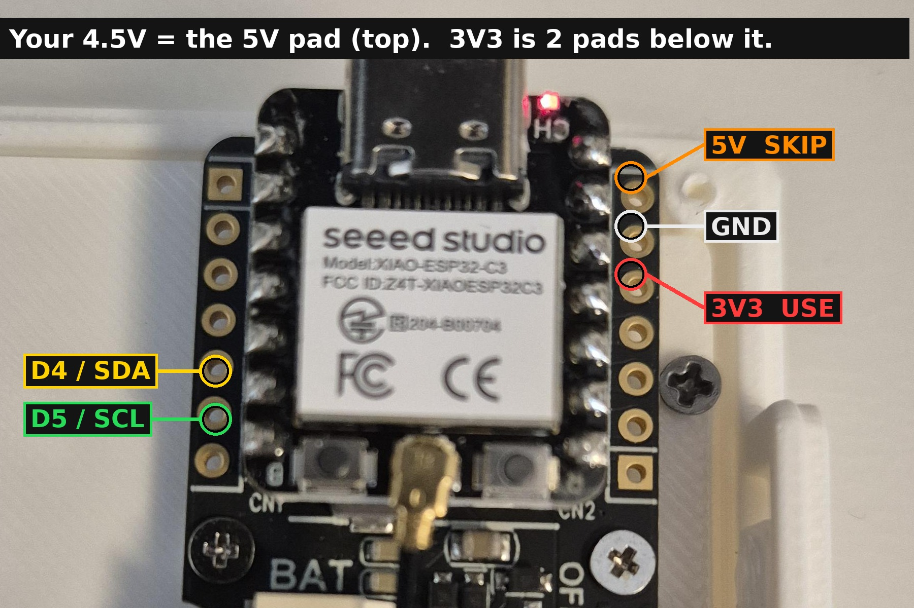

# hebrew-time-rtc

A **Hebrew word clock** that displays the current time spelled out in Hebrew
words (with full niqud) on a 7.5″ e-ink panel. Time is kept by a battery-backed
DS3231 hardware RTC, so the clock survives power loss and stays accurate to the
second without any network connection.

The time is set from a phone or laptop over a self-hosted Wi-Fi access point
with a captive portal — no router, no NTP, no cloud.

---

## Features

- **Time in Hebrew words** — e.g. *"שָׁלוֹשׁ וְעֶשֶׂר דַקּוֹת בַּבֹּקֶר"* (3:10 in the morning),
  rendered right-to-left with correctly positioned vowel marks (niqud).
- **Battery-backed timekeeping** — a DS3231 RTC holds the time across reboots
  and power cuts; no Wi-Fi or NTP needed to stay accurate.
- **Set the time from any browser** — connect to the open `HebTime` Wi-Fi
  network and the captive portal opens automatically; one tap writes the
  device's clock to the RTC.
- **DST-correct** — the RTC stores **UTC**; the Israel timezone
  (`Asia/Jerusalem`, UTC+2 / UTC+3 with DST) is applied only for display, so the
  clock changes for daylight saving on its own.
- **Selectable top-row date** — show either the **Gregorian** date
  (e.g. `14 בְּיוּנִי 2026`) or the **Hebrew/Jewish** date
  (e.g. `כ״ט בְּסִיוָן תשפ״ו`). The choice is saved in flash.
- **E-ink friendly** — partial refresh on every minute change, a full refresh
  periodically and whenever the date changes, to keep the panel clean and
  ghost-free.

---

## Hardware

| Part | Detail |
|---|---|
| MCU | **Seeed Studio XIAO ESP32-C3** |
| Display | **7.5″ e-paper**, 800 × 480, on the Seeed XIAO ePaper Driver Board (UC8179, board/screen combo **502**) |
| RTC | **DS3231** (I²C, battery-backed) |
| Power | USB-C (the AP stays up so the time can be reset at any time — no deep sleep) |

### Wiring (RTC ↔ XIAO)

The e-paper driver board uses the XIAO's default SPI pins **and** GPIO4/GPIO5
(D2/D3) for the panel's BUSY/DC lines, so the DS3231 must sit on the secondary
I²C pins:

| DS3231 | XIAO pin | GPIO |
|---|---|---|
| SDA | **D4** | GPIO6 |
| SCL | **D5** | GPIO7 |
| VCC | 3V3 | — |
| GND | GND | — |

The solder pads on the XIAO ESP32-C3 (SDA → **D4**, SCL → **D5**, plus
**3V3** and **GND**) are shown below. Power the DS3231 from the **3V3** pad —
**not** the 5 V pad two positions above it:



See **[rtc.md](rtc.md)** for the full RTC setup, time-setting flow, and
troubleshooting.

---

## Software / build

### Toolchain
- **Arduino IDE** (or arduino-cli) with the **ESP32 board package**; select the
  **XIAO ESP32-C3** board.
- Open the sketch at `Arduino/Clock/Clock.ino`.

### Libraries
The sketch depends on (vendored under `Arduino/libraries/`):

- **Seeed_GFX** — provides the `EPaper`/`TFT_eSPI`-compatible driver for the
  XIAO ePaper board.
- **RTClib** (+ **Adafruit_BusIO**) — DS3231 access.
- **Adafruit_GFX_Library** — font/glyph primitives (`GFXfont`).
- **U8g2_for_Adafruit_GFX**, **GxEPD2**, **ArduinoJson** — supporting libs.

### Driver / board selection
`Arduino/Clock/driver.h` selects the panel:

```c
#define BOARD_SCREEN_COMBO 502
#define USE_XIAO_EPAPER_DRIVER_BOARD
```

### Enable partial refresh (required)
To compile the partial-update path, add this line to your TFT/e-paper setup
header (e.g. `User_Setups/Setup502_Seeed_XIAO_EPaper_7inch5.h`):

```c
#define USE_PARTIAL_EPAPER
```

Without it, `epaper.updataPartial()` won't compile. (Yes — `updata` is the
actual spelling in the upstream library.)

---

## Usage

1. Flash `Clock.ino` to the XIAO ESP32-C3.
2. On first boot the RTC has lost power, so the panel shows
   *"Connect to HebTime WiFi to set the time"*.
3. Join the Wi-Fi network **`HebTime`** (open, no password). A captive-portal
   page opens automatically (or browse to `http://192.168.4.1`).
4. Tap **Set Time**. The browser's current time is written to the RTC as UTC.
5. Optionally pick the **top-row date** mode (Gregorian / Hebrew). The setting
   persists across reboots.

The clock then runs on its own. The AP stays active, so you can reconnect and
re-set the time at any point.

---

## How it works

- **Time source.** `setup()` reads the DS3231 over I²C and seeds the ESP32
  soft-clock with `settimeofday()`; the soft-clock is re-synced from the RTC
  every 60 s to avoid drift. The display redraws on each minute change.
- **Timezone.** The RTC always holds **UTC**. The POSIX TZ string
  `IST-2IDT,M3.4.4/26,M10.5.0` is set via `setenv("TZ", …)` + `tzset()`, so
  `getLocalTime()` yields Israel local time with automatic DST.
- **Word rendering.** Hebrew time phrases live in `time_words.h` (hours, the
  `ל`-prefixed "to the hour" forms for :40/:45/:50/:55, minute fragments, and
  the time-of-day period — בַּבֹּקֶר / בַּצָּהֳרַיִם / בָּעֶרֶב / בַּלַּיְלָה).
  A custom RTL renderer reverses each word for the LTR framebuffer and centers
  each niqud mark on its base letter (GFX fonts have no GPOS, so combining marks
  are positioned manually).
- **Font.** A single 85 px `NotoSerifHebrew_Bold_85` bitmap font is downscaled
  on the fly (majority-sampling) for the smaller date line.
- **Hebrew date.** `hebrew_date.h` is a generated Gregorian→Hebrew lookup table
  (range **2026-06-01 … 2031-01-01**), binary-searched per day; geresh/gershayim
  numerals are swapped for ASCII `'`/`"` (the font lacks those code points).
- **Refresh strategy.** Minute changes use a differential **partial refresh**; a
  **full refresh** runs on first boot, on date change, and every 15 partials to
  clear e-ink ghosting.

---

## Project layout

```
Arduino/Clock/
  Clock.ino                     main sketch (RTC, AP/captive portal, rendering)
  driver.h                      board/panel selection (combo 502)
  time_words.h                  Hebrew hour/minute/period word tables
  hebrew_date.h                 generated Gregorian→Hebrew date table
  hebrew24.h / hebrew24_ram.h   supporting Hebrew tables
  NotoSerifHebrew_Bold_85.h     85px Hebrew bitmap font
  secrets.h                     legacy stub — no credentials needed
Arduino/libraries/              vendored Arduino libraries
Fonts/                          source TTFs used to generate the bitmap font
rtc.md                          RTC wiring, time-setting & troubleshooting
```

---

## License

See [LICENSE](LICENSE).
